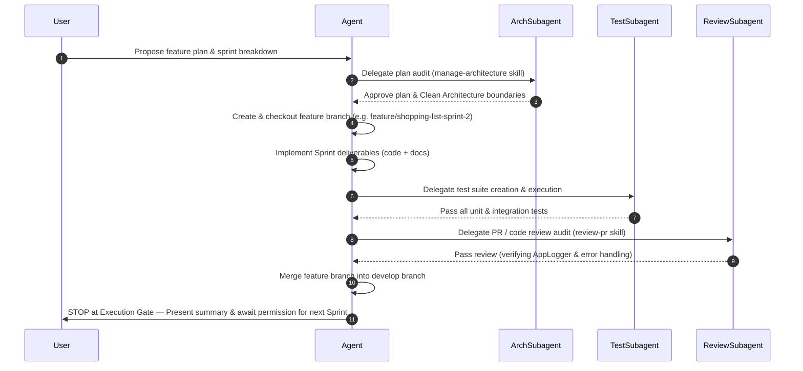

# GitFlow Branching & Sprint Execution Workflow

This skill defines the mandatory GitFlow branching rules, multi-agent peer review audits, testing requirements, and sprint execution gates for **ShoppingExplore**.

## 1. Branching & GitFlow Hierarchy

- **`main` Branch**: Production-grade code.
  - **RULE**: NEVER develop, commit, or merge directly to `main`.
  - **RULE**: Merging `develop` into `main` is strictly reserved for the user or explicit user instruction.
- **`develop` Branch**: Main integration branch for all ongoing development.
  - Initialized from `main`.
  - Receives merges from completed sprint feature branches after tests and code review pass.
- **Feature/Sprint Branches**:
  - Dedicated branches for each feature or sprint (e.g., `feature/<name>` or `feature/<name>-sprint-<number>`).
  - Created from `develop` (or `main` at project initialization).

## 2. Multi-Agent Sprint Execution Protocol

For every feature sprint, execute the following strict sequence:

### Mandatory Subagent Rules
1. **Architecture Manager Subagent (`manage-architecture` skill)**: Audits every development plan and sprint breakdown before coding starts, validates layer boundaries (`domain/`, `data/`, `presentation/`), enforces domain purity (.NET Analogy), and oversees `/docs/` documentation synchronization.
2. **Testing Subagent**: Dedicated agent writes and runs unit/integration tests to guarantee unbiased test coverage.
3. **Reviewer Subagent (`review-pr` skill)**: Independent review audit must explicitly verify:
   - Clean Architecture compliance (no UI imports in domain layer).
   - Telemetry: Proper use of `AppLogger` (`d`, `i`, `w`, `e`) across repositories, data sources, and controllers.
   - Error Handling: Typed `Result<T>` and `Failure` hierarchy without swallowed exceptions.
4. **Maintenance & Debugging Subagent (`manage-maintenance` skill)**: Governs proactive framework modernization (Material 3 tokens, `dart analyze` zero-tolerance, automated `dart fix --apply`), dependency conflict resolution, and reactive bug/layout overflow debugging with mandatory regression test coverage.

## 3. Sprint Execution Gate (Strict Pause)

- **RULE**: Under no circumstances may an agent automatically proceed from Sprint $N$ to Sprint $N+1$.
- Upon completing Sprint $N$ (implementation + tests + review audit + merge to `develop`), the agent MUST **STOP** and wait for explicit user approval to resume to Sprint $N+1$.

## 4. Documentation Synchronization

- Any code, module, file, or architecture modification must be synchronously updated in `/docs/` using Obsidian-style markdown (YAML frontmatter, wikilinks, callouts, and Mermaid diagrams).
