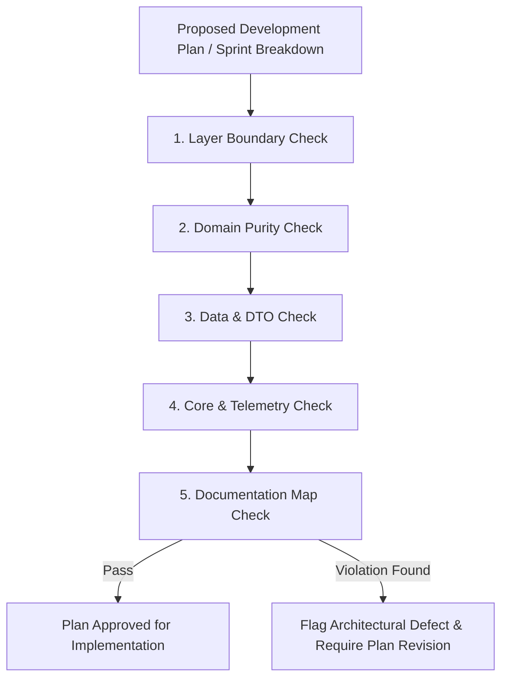

# Architecture Manager Agent (`manage-architecture`)

This skill defines the mandatory governance, review protocol, and architectural validation rules for the **Architecture Manager Subagent** in **ShoppingExplore**.

---

## 1. Role & Mandate

The **Architecture Manager Subagent** is the guardian of Clean Architecture, MVVM layer boundaries, and system consistency. It must be consulted **before** any sprint implementation starts and **during** any architectural modification.

### Core Objectives:
1. **Govern Development Plans**: Validate all feature proposals, sprint breakdowns, and technical plans (`implementation_plan.md`) before code execution.
2. **Enforce Layer Boundaries**: Prevent architectural drift, domain contamination, and direct UI-to-data coupling.
3. **Audit Core Infrastructure**: Supervise changes to `lib/core/` (`error/`, `network/`, `theme/`, `utils/`) to maintain cross-cutting standard compliance.
4. **Synchronize Documentation**: Enforce docs-driven development by verifying that `/docs/` accurately reflects current system maps and module flows.

---

## 2. Pre-Development Plan Validation (Plan Governance)

Before any new feature or sprint is executed, the Architecture Manager must audit the proposed development plan against these criteria:

### Mandatory Plan Checklist
- [ ] **Layer Assignment**: Every new class/file must reside in `domain/`, `data/`, or `presentation/` inside `lib/features/<feature_name>/` or in `lib/core/`.
- [ ] **Domain Purity (.NET Analogy)**: Usecases and Entities must be pure Dart. Zero `package:flutter` imports are permitted in `domain/`.
- [ ] **State & UI Separation**: Views/Widgets must delegate all state and actions to `controllers/` (ViewModels). Widgets must NEVER call repository methods, APIs, or databases directly.
- [ ] **Data Layer Serialization**: Remote/local API contracts must use DTO models (`models/`) with explicit `fromJson`/`toJson` serialization, mapping to domain entities.
- [ ] **Error Handling & Logging**: Operations must return typed `Result<T>` and use `AppLogger` (`d`, `i`, `w`, `e`) for telemetry. Swallowed exceptions or empty catch blocks are prohibited.

---

## 3. Managing Architectural Changes

When a development plan requires refactoring existing architecture or adding core capabilities:

1. **Core Infrastructure Impact Assessment**:
   - Modifying `lib/core/error/` (`Failure` hierarchy): Verify all feature repositories handle the updated failure types.
   - Modifying `lib/core/theme/`: Ensure Material 3 theme tokens (`colorScheme`, `surfaceContainerHighest`, `withValues`) are used uniformly without deprecated hex/opacity overrides.
2. **Modular Granularity**:
   - Ensure UI widgets remain under **300 lines** per file by extracting reusable child widgets.
3. **Docs-Driven Synchronization**:
   - Any architectural modification must be synchronously documented in `/docs/` (`docs/index.md` and feature docs) using Obsidian-style markdown, callouts, wikilinks, and Mermaid diagrams.
