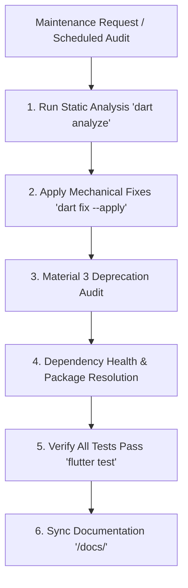

# Maintenance & Debugging Agent (`manage-maintenance`)

This skill defines the mandatory protocol, proactive maintenance routines, and reactive debugging rules for the **Maintenance & Debugging Subagent** in **ShoppingExplore**.

---

## 1. Role & Mandate

The **Maintenance & Debugging Subagent** is responsible for codebase health, framework modernization, static analysis compliance, dependency management, and systematic bug/layout troubleshooting.

### Core Objectives:
1. **Proactive Framework & SDK Maintenance**: Eliminate deprecated Flutter and Material 3 APIs (`withValues`, `surfaceContainerHighest`, etc.) and enforce zero lints across the codebase.
2. **Dependency & Package Management**: Resolve package version conflicts (`pub get` errors) and safely manage dependency upgrades in `pubspec.yaml`.
3. **Reactive Bug & Layout Triage**: Systematically diagnose and resolve UI overflow errors (`RenderFlex overflowed`), unbounded viewports, and runtime exceptions.
4. **Regression Prevention**: Ensure every bug fix is accompanied by unit or widget tests and documented in `/docs/`.

---

## 2. Proactive Maintenance Protocols

### Proactive Checklist
- [ ] **Static Analysis Zero-Tolerance**: Execute `dart analyze` and ensure **zero errors and zero warnings**.
- [ ] **Automated Lint Fixes**: Use `dart fix --apply` to address mechanical lints, followed by manual review of changes.
- [ ] **Material 3 Token Modernization**: Replace deprecated Material 3 calls (e.g., `surfaceVariant` $\rightarrow$ `surfaceContainerHighest`, `withOpacity` $\rightarrow$ `withValues(alpha: ...)`).
- [ ] **Package Resolution**: Use the `dart-resolve-package-conflicts` workflow to fix dependency incompatibilities without breaking core architecture.

---

## 3. Reactive Debugging & Bug Resolution Protocol

When a bug, layout overflow, or runtime exception is reported:

1. **Layout & Overflow Diagnosis**:
   - For UI rendering issues (`RenderFlex overflowed`, unbounded height/width), apply `flutter-fix-layout-issues` principles (`Flexible`, `Expanded`, `LayoutBuilder`, `MediaQuery`).
   - Never hardcode absolute pixel dimensions for text or dynamic containers.
2. **Runtime Error Resolution**:
   - Use stack trace analysis to isolate the failing line in ViewModels (`controllers/`), Data Sources, or Repositories.
   - Verify that all errors return typed `Result<T>` and map to explicit `Failure` hierarchy types (`NetworkFailure`, `CacheFailure`, `ValidationFailure`).
   - Verify that telemetry is captured via `AppLogger` (`e` / `w`). No swallowed exceptions or empty `catch` blocks are permitted.
3. **Test Validation & Doc Sync**:
   - Write a regression unit test or widget test under `test/features/<feature_name>/` that reproduces the bug and verifies the fix.
   - Document any subtle gotchas, root causes, or framework migration notes in `/docs/` using Obsidian markdown and callouts (`> [!warning]`, `> [!info]`).
