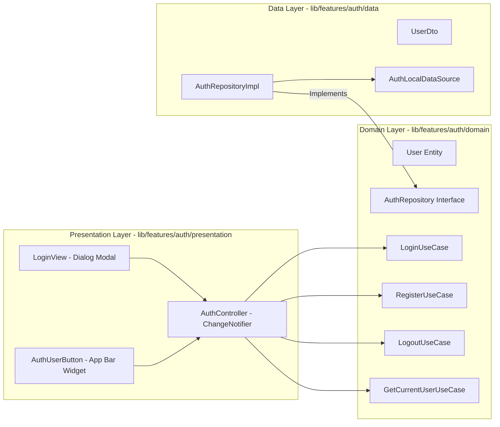

# Authentication Module

> [!info]
> Governs user authentication, current session state, and user identity across ShoppingExplore.

## Architecture & Layers

## Key Components

1. **Domain Entities & UseCases**:
   - **`User`**: Immutable entity containing `id`, `email`, `displayName`, `avatarUrl`, and `createdAt`.
   - **`AuthRepository`**: Pure Dart contract for authentication operations returning typed `Result<T>`, including profile updates and persistent session management.
   - **UseCases**: Single-responsibility actions (`LoginUseCase`, `RegisterUseCase`, `LogoutUseCase`, `GetCurrentUserUseCase`, `UpdateUserProfileUseCase`, `RestorePersistentSessionUseCase`).

2. **Data Source & Repository Implementation**:
   - **`AuthLocalDataSource`**: Provides local/in-memory user authentication, profile updating, and session persistence (`savePersistentSession`, `restorePersistentSession`). `InMemoryAuthDataSource` supports `startAuthenticated` parameter (default `true` for unit tests, configured to `false` in `app.dart` so app launches unauthenticated). Seeded with Debug User **Guy C** (`guy@shoppingexplore.com`, `guyc@shoppingexplore.com`, `guyc2@shoppingexplore.com`, password `password123`).
   - **`AuthRepositoryImpl`**: Implements domain repository contract with centralized `AppLogger` telemetry and typed `Failure` mapping.

3. **Presentation & State**:
   - **`AuthController`**: `ChangeNotifier` managing `AuthState` (`AuthInitial`, `AuthLoading`, `Authenticated`, `Unauthenticated`, `AuthError`). Wired at the root in `ShoppingExploreApp` (`lib/app.dart`), with an active listener that automatically re-subscribes and reloads `ShoppingListController` when state changes to `Authenticated` or `Unauthenticated`.
   - **`AuthErrorMapper`**: Presentation utility (`lib/features/auth/presentation/utils/auth_error_mapper.dart`) mapping raw Firebase Auth exception codes (`invalid-email`, `user-disabled`, `user-not-found`, `wrong-password`, `email-already-in-use`, `weak-password`, `network-request-failed`, `invalid-credential`, `operation-not-allowed`) into localized Hebrew (`'he'`) and English (`'en'`) messages via `AppLocalizations`.
   - **`LoginView`**: Refactored Material 3 modal card layout:
     - **Pinned Action Button Bar**: Action buttons (`Cancel`, `Register` / `Sign In`, `Continue with Google`) are pinned at the bottom and remain 100% visible above the virtual keyboard.
     - **Scrollable Field Container**: Input fields container is wrapped in a `SingleChildScrollView` inside `Expanded` to prevent keyboard overflow issues.
     - **Auto-Clearing Password Field**: Password `TextField` uses a `FocusNode` and `onTap` handler that automatically clears the password field on first focus/tap during Sign-Up mode.
     - **Registration Auto-Login**: Upon successful registration, closes the modal and immediately transitions the user into their authenticated account dashboard.
   - **`AccountProfileModal`**: Displayed from `AuthUserButton` menu; shows user statistics (total lists, total items, shared lists) and includes an inline **Profile Editing Mode** allowing users to update their Display Name and select an Avatar Style badge.
   - **`AuthUserButton` & Auth Guard**: Responsive header widget displaying authentication buttons when unauthenticated, and user avatar with profile/logout menu when authenticated. When unauthenticated, `ShoppingListView` renders a stylish **Auth Guard** card with lock badge and authentication actions, protecting list contents until signed in.

