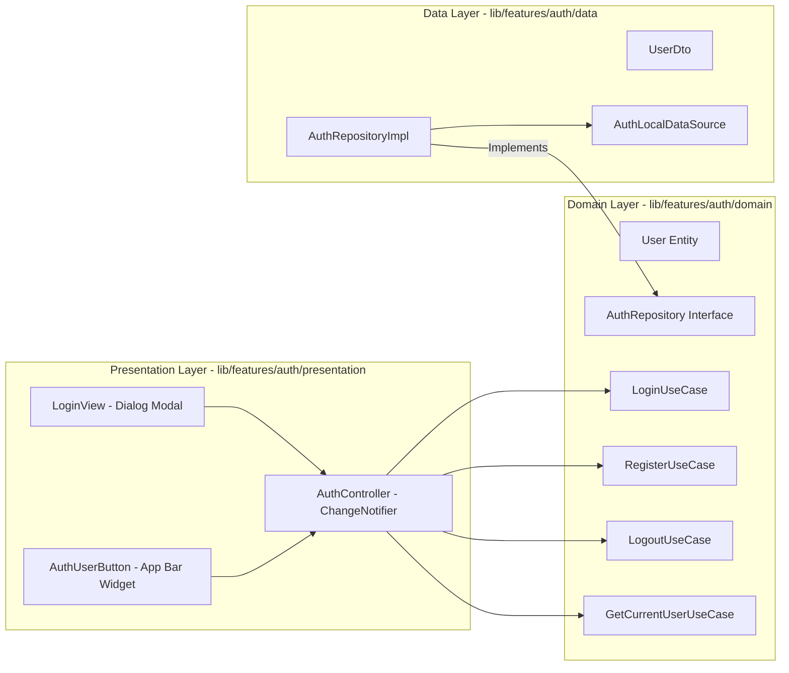

# Authentication Module

> [!info]
> Governs user authentication, current session state, and user identity across ShoppingExplore.

## Architecture & Layers

## Key Components

1. **Domain Entities & UseCases**:
   - **`User`**: Immutable entity containing `id`, `email`, `displayName`, and `createdAt`.
   - **`AuthRepository`**: Pure Dart contract for authentication operations returning typed `Result<T>`.
   - **UseCases**: Single-responsibility actions (`LoginUseCase`, `RegisterUseCase`, `LogoutUseCase`, `GetCurrentUserUseCase`).

2. **Data Source & Repository Implementation**:
   - **`AuthLocalDataSource`**: Provides local/in-memory user authentication and session caching. `InMemoryAuthDataSource` supports `startAuthenticated` parameter (default `true` for unit tests, configured to `false` in `app.dart` so app launches unauthenticated). Seeded with Debug User **Guy C** (`guy@shoppingexplore.com`, `guyc@shoppingexplore.com`, `guyc2@shoppingexplore.com`, password `password123`).
   - **`AuthRepositoryImpl`**: Implements domain repository contract with centralized `AppLogger` telemetry and typed `Failure` mapping.

3. **Presentation & State**:
   - **`AuthController`**: `ChangeNotifier` managing `AuthState` (`AuthInitial`, `AuthLoading`, `Authenticated`, `Unauthenticated`, `AuthError`). Wired at the root in `ShoppingExploreApp` (`lib/app.dart`).
   - **`LoginView`**: Material 3 modal dialog supporting both Sign In and Sign Up modes via a prominent `SegmentedButton` toggle, localized Hebrew (`'he'`) / English (`'en'`) strings, and a 1-click **"Quick Debug Login as Guy C"** chip for rapid testing.
   - **`AuthUserButton`**: Responsive header widget displaying both "Sign In" and "Sign Up" buttons when unauthenticated, and user avatar with logout/switch account menu when authenticated.

