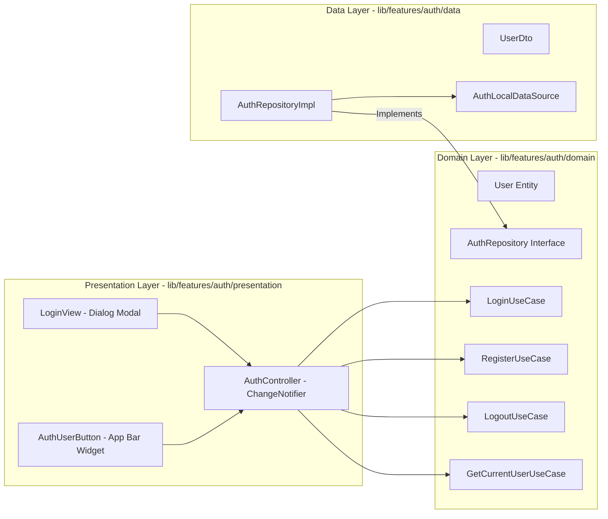

# Authentication Module

> [!info]
> Governs user authentication, current session state, and user identity across ShoppingExplore.

## Architecture & Layers

## Key Components

1. **Domain Entities & UseCases**:
   - **`User`**: Immutable entity containing `id`, `email`, `displayName`, `avatarUrl`, and `createdAt`.
   - **`AuthRepository`**: Pure Dart contract for authentication operations returning typed `Result<T>`, including profile updates and persistent session management.
   - **UseCases**: Single-responsibility actions (`LoginUseCase`, `RegisterUseCase`, `LogoutUseCase`, `GetCurrentUserUseCase`, `UpdateUserProfileUseCase`, `RestorePersistentSessionUseCase`).

2. **Data Source & Repository Implementation**:
   - **`AuthLocalDataSource`**: Provides local/in-memory user authentication, profile updating, and session persistence (`savePersistentSession`, `restorePersistentSession`). `InMemoryAuthDataSource` supports `startAuthenticated` parameter (default `true` for unit tests, configured to `false` in `app.dart` so app launches unauthenticated). Seeded with Debug User **Guy C** (`guy@shoppingexplore.com`, `guyc@shoppingexplore.com`, `guyc2@shoppingexplore.com`, password `password123`).
   - **`AuthRepositoryImpl`**: Implements domain repository contract with centralized `AppLogger` telemetry and typed `Failure` mapping.

3. **Presentation & State**:
   - **`AuthController`**: `ChangeNotifier` managing `AuthState` (`AuthInitial`, `AuthLoading`, `Authenticated`, `Unauthenticated`, `AuthError`). Wired at the root in `ShoppingExploreApp` (`lib/app.dart`). Uses `RestorePersistentSessionUseCase` during `checkAuthStatus()` to automatically restore saved sessions.
   - **`LoginView`**: Material 3 modal dialog supporting both Sign In and Sign Up modes via a prominent `SegmentedButton` toggle, localized Hebrew (`'he'`) / English (`'en'`) strings, a **"Remember me on this device"** checkbox for persistent sessions, and a 1-click **"Quick Debug Login as Guy C"** chip for rapid testing.
   - **`AccountProfileModal`**: Displayed from `AuthUserButton` menu; shows user statistics (total lists, total items, shared lists) and includes an inline **Profile Editing Mode** allowing users to update their Display Name and select an Avatar Style badge.
   - **`AuthUserButton` & Auth Guard**: Responsive header widget displaying authentication buttons when unauthenticated, and user avatar with profile/logout menu when authenticated. When unauthenticated, `ShoppingListView` renders a stylish **Auth Guard** card with lock badge and authentication actions, protecting list contents until signed in.

