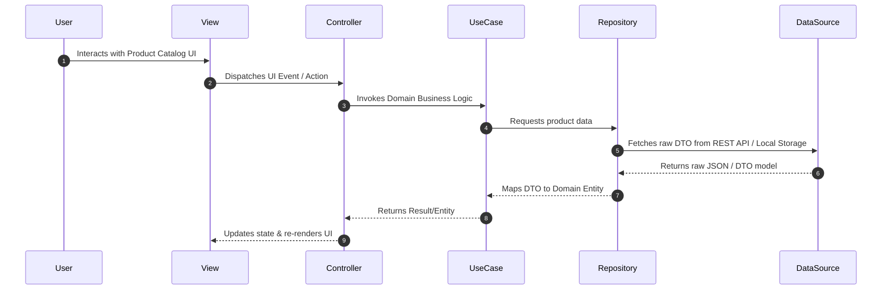

# Catalog Module

**Purpose** — Encapsulates the product browsing, category management, and product detail features for the application. It organizes code into three distinct layers: presentation, domain logic, and data access.

**Key files** —
- [catalog/domain/](../lib/features/catalog/domain) — Contains pure Dart entities, repository interfaces, and business use cases.
- [catalog/data/](../lib/features/catalog/data) — Implements data sources, serialization models (DTOs), and domain repository implementations.
- [catalog/presentation/](../lib/features/catalog/presentation) — Contains UI views, component widgets, and state management controllers.

**Dependencies** — Depends on [[core|Core Infrastructure]] for network communication, failure types, and theme tokens. Expected to be referenced by main application routing (inferred).

**Flow** —

**Notes / gotchas** —
> [!warning] Layer Boundaries
> Pure Dart rules in `catalog/domain/` strictly prohibit importing `package:flutter` UI code. Presentation widgets must never access data sources or network endpoints directly. Layer folders currently hold `.gitkeep` placeholders awaiting feature implementation.
