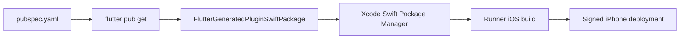

# iOS Build and Deployment

ShoppingExplore uses Swift Package Manager (SwiftPM) for native iOS plugin dependencies. CocoaPods is not required for the current plugin set.

## Prerequisites
- Flutter 3.44 or newer (validated with Flutter 3.47.2).
- Xcode 26.6 or newer with its license accepted.
- A connected, trusted iPhone with Developer Mode enabled.
- An Apple ID configured in Xcode and a unique application bundle identifier.

> [!warning] Minimum supported iOS version
> The SwiftPM migration raises the deployment target from iOS 13 to iOS 15. Devices running iOS 13 or 14 are no longer supported.

> [!important] Workspace ownership
> Open and resolve packages through `ios/Runner.xcworkspace`. The workspace is tracked and references `Runner.xcodeproj`. SwiftPM resolution metadata under `.swiftpm/` and nested Xcode project workspaces remains generated and ignored.

## Dependency flow


## Build validation
```sh
export PATH="$HOME/development/flutter/bin:$PATH"
export DEVELOPER_DIR="/Applications/Xcode.app/Contents/Developer"

flutter clean
flutter pub get
xcodebuild -resolvePackageDependencies \
  -workspace ios/Runner.xcworkspace \
  -scheme Runner
flutter build ios --release --no-codesign
```

The build must not emit a CocoaPods fallback warning or create `ios/Podfile`, `ios/Podfile.lock`, or `ios/Pods/`.

## Deploy to an iPhone
1. Connect and unlock the iPhone, trust the Mac, and enable Developer Mode.
2. Open `ios/Runner.xcworkspace` in Xcode.
3. In **Runner → Signing & Capabilities**, enable automatic signing, choose an Apple development team, and set a unique bundle identifier.
4. Select the iPhone and run from Xcode, or use `flutter run -d <device-id>`.

> [!warning] Free Apple ID
> A personal development signing profile is sufficient for testing, but the installed application normally expires after seven days.

## Troubleshooting
> [!failure] Xcode workspace not found
> Confirm that `ios/Runner.xcworkspace/contents.xcworkspacedata` exists and references `Runner.xcodeproj`. A nested `Runner.xcodeproj/project.xcworkspace` does not replace the application workspace.

See also [[workflow|Development & Sprint Workflow]] and [[core|Core Infrastructure]].
