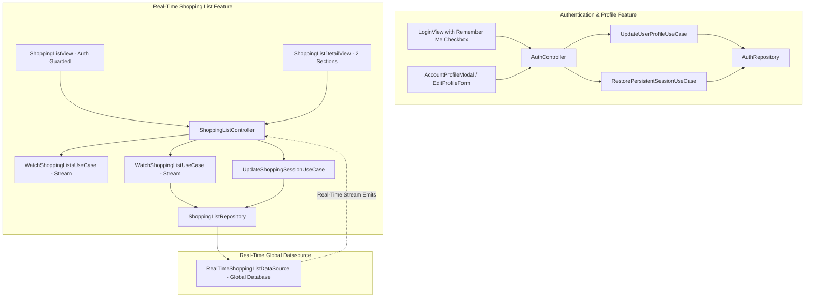
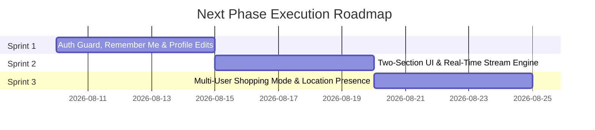

# Next Phase Plan: Real-Time Collaborative Shopping, Personal Profile Editing & Persistent Auth

> [!warning] Future Implementation Plan — DO NOT EXECUTE YET
> This document defines the architectural blueprint and sprint breakdown for the **next phase** of ShoppingExplore development. Per user instruction, this plan is documented for future execution and MUST NOT be implemented until explicit user authorization is given.

---

## Executive Summary

The next phase of **ShoppingExplore** transforms the application into a **real-time, multi-user collaborative shopping platform**. It introduces persistent authentication with explicit user consent ("Remember Me"), profile editing capabilities, an intuitive two-section list layout (unmarked vs. marked items), and a concurrency-enabled **Active Shopping Mode** where multiple collaborators can shop simultaneously at specified locations with live presence indicators.

---

## Architectural Blueprint & System Design



---

## Detailed Requirements Specification

### 1. Enable Editing Personal Information
- **Domain Layer**:
  - Add `UpdateUserProfileUseCase(AuthRepository)` in `lib/features/auth/domain/usecases/`.
  - Extend `AuthRepository` interface with `Future<Result<User>> updateProfile({required String displayName, String? avatarUrl})`.
- **Data Layer**:
  - Update `User` and `UserDto` to support mutable profile edits.
  - Implement persistence for profile changes in local and remote data sources.
- **Presentation Layer**:
  - Enhance `AccountProfileModal` with an **"Edit Profile" (`ערוך פרופיל`)** mode.
  - Users can update their display name and profile image identifier with inline form validation and instant feedback.

### 2. Universal Two-Section List Display (Unmarked Above, Marked Below)
- **UI/UX Refactor**:
  - In `ShoppingListDetailView`, every shopping list is permanently organized into **two distinct, clear sections**:
    1. **Unmarked / Active Items (`פריטים שלא סומנו`)** at the top.
    2. **Marked / Completed Items (`פריטים שסומנו`)** at the bottom.
  - Marking/checking an item smoothly transitions it from the top unmarked section to the bottom marked section, ensuring clarity during everyday list management and active shopping.

### 3. & 4. Multi-User Active Shopping Mode with Location & Live Presence
- **Multi-User Concurrency**:
  - Multiple shared collaborators can be in **Active Shopping Mode** on the same list concurrently.
- **Location Specification**:
  - When a user taps **"Start Shopping"**, they are prompted with an option to specify **where** they are shopping (e.g., *"Rami Levy"*, *"Shufersal"*, *"Costco"*, *"Local Farmers Market"*).
- **Live Presence Indicator**:
  - Other collaborators viewing the list see a real-time **Active Shoppers Banner** at the top of the list:
    - *example: "Guy C is shopping at Rami Levy • Sarah is shopping at Shufersal"*.
- **Domain Model (`ActiveShoppingSession`)**:
  ```dart
  class ActiveShoppingSession extends Equatable {
    final String userEmail;
    final String displayName;
    final String? avatarUrl;
    final String? locationName;
    final DateTime startedAt;
  }
  ```
- **Authentication Guard**:
  - When a user is **not logged in** (unauthenticated guest), they **cannot see any lists**. The home dashboard (`ShoppingListView`) displays an Unauthenticated Guard Screen prompting the user to Sign In or Create an Account.

### 5. Persistent Login ("Remember Me" After User Approval)
- **Explicit User Approval**:
  - In `LoginView` and `RegisterView`, add an explicit checkbox: **"Remember me on this device" (`זכור אותי במכשיר זה`)**.
- **Persistent Session Storage**:
  - When approved, user credentials/session tokens are saved to persistent local storage (`SharedPreferences` or Secure Storage).
- **Automatic Session Restoration**:
  - On application startup (`App.initState`), the `AuthController` checks for a stored persistent session and automatically restores the user's login state without requiring re-authentication.

### 6. Real-Time Global Database Synchronization
- **Immediate Reactive Updates**:
  - Any list modification (adding an item, checking an item, updating properties, entering/exiting shopping mode, or changing location) immediately writes to the global database and broadcasts to all shared collaborators.
- **Reactive Streams in Domain Layer**:
  - Extend `ShoppingListRepository` with reactive stream contracts:
    - `Stream<List<ShoppingList>> watchShoppingLists(String userEmail)`
    - `Stream<ShoppingList> watchShoppingList(String listId)`
- **ViewModel Stream Subscriptions**:
  - `ShoppingListController` subscribes to repository streams so that UI state updates instantly when peer collaborators modify shared lists.

---

## Planned Sprints Breakdown (Future Execution)



### Sprint 1: Authentication Guard, Persistent "Remember Me" & Profile Editing
1. Implement `UpdateUserProfileUseCase` and wire an editable profile form into `AccountProfileModal`.
2. Add `"Remember me on this device"` checkbox to login/signup flows with persistent storage and auto-restore on app launch.
3. Enforce Authentication Guard on `ShoppingListView`: unauthenticated users cannot view lists and are prompted to log in.
4. Author unit/widget tests and verify bilingual ARB translations (`he` / `en`).

### Sprint 2: Real-Time Stream Engine & Two-Section List Layout
1. Upgrade `ShoppingListRepository` and data sources to support real-time reactive streams (`watchShoppingLists`, `watchShoppingList`).
2. Refactor `ShoppingListController` to subscribe to live database streams for instant synchronization across shared users.
3. Refactor `ShoppingListDetailView` to render **Unmarked Items** above and **Marked Items** below.
4. Author regression tests for real-time stream emissions and two-section ordering.

### Sprint 3: Multi-User Active Shopping Mode with Location & Presence
1. Create `ActiveShoppingSession` domain entity and DTO serialization (`ActiveShoppingSessionDto`).
2. Update `enterShoppingMode(String listId, {String? locationName})` to support concurrent multi-user sessions per list.
3. Add **Location Selector Modal** when starting shopping mode.
4. Render real-time **Active Shoppers Banner** showing which collaborators are shopping and where.
5. Author multi-user concurrency tests, review via PR Reviewer subagent, and sync Obsidian docs.

---

## Alignment with Core Workspace Rules
- **Clean Architecture / MVVM**: Pure Dart domain models (`ActiveShoppingSession`), strict layer separation, and repository streams.
- **Bilingual & RTL**: All new UI components, banners, and forms will support both Hebrew (`he`) and English (`en`).
- **Execution Governance**: Each Sprint will be executed sequentially with dedicated Testing and Reviewer subagents and strict user approval gates.
