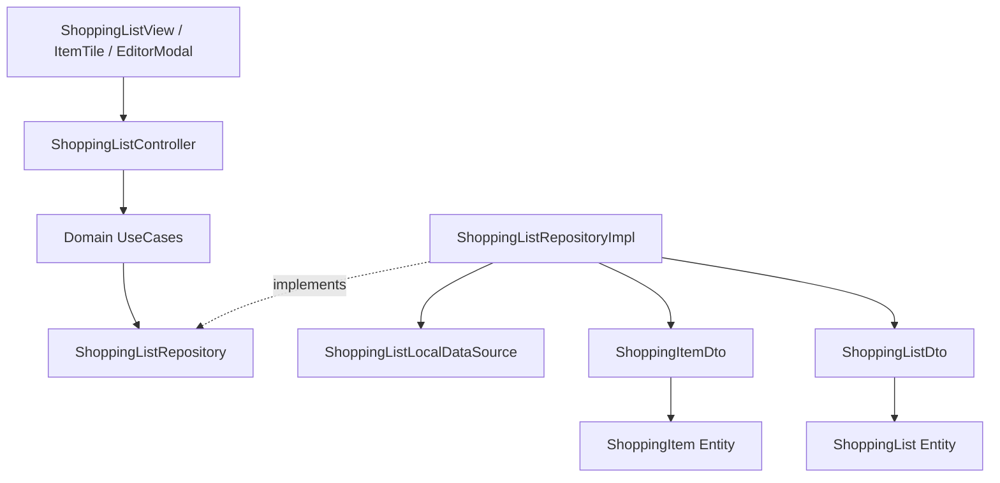

# Shopping List Module

**Purpose** — Encapsulates the core business logic, domain entities, and data access layer for the Advanced Shopping List feature. It supports both simple checklist items and complex items with rich properties (images, links, priority, notes, attributes).

**Key files** —
- [shopping_list/domain/entities/shopping_item.dart](../lib/features/shopping_list/domain/entities/shopping_item.dart) — Pure Dart entity representing a shopping item with rich attributes.
- [shopping_list/domain/entities/shopping_list.dart](../lib/features/shopping_list/domain/entities/shopping_list.dart) — Pure Dart entity representing a shopping list container.
- [shopping_list/domain/repositories/shopping_list_repository.dart](../lib/features/shopping_list/domain/repositories/shopping_list_repository.dart) — Abstract repository contract for shopping list operations.
- [shopping_list/data/models/shopping_item_dto.dart](../lib/features/shopping_list/data/models/shopping_item_dto.dart) — DTO model handling JSON serialization and entity conversion.
- [shopping_list/data/models/shopping_list_dto.dart](../lib/features/shopping_list/data/models/shopping_list_dto.dart) — DTO model for shopping list JSON serialization.
- [shopping_list/data/datasources/shopping_list_local_datasource.dart](../lib/features/shopping_list/data/datasources/shopping_list_local_datasource.dart) — Local data source interface and in-memory cache implementation.
- [shopping_list/data/repositories/shopping_list_repository_impl.dart](../lib/features/shopping_list/data/repositories/shopping_list_repository_impl.dart) — Concrete repository implementation mapping DTOs to Domain Entities.
- [shopping_list/domain/usecases/](../lib/features/shopping_list/domain/usecases) — Business logic actions: `GetShoppingLists`, `CreateShoppingItem`, `ToggleItemCompletion`, `UpdateItemProperties`, `DeleteShoppingItem`.
- [shopping_list/presentation/controllers/shopping_list_controller.dart](../lib/features/shopping_list/presentation/controllers/shopping_list_controller.dart) — ViewModel managing list state (`ShoppingListState`) and operations with integrated logging.
- [shopping_list/presentation/views/shopping_list_view.dart](../lib/features/shopping_list/presentation/views/shopping_list_view.dart) — Main screen displaying items, dark/light theme toggle, and quick-add checklist input.
- [shopping_list/presentation/widgets/shopping_item_tile.dart](../lib/features/shopping_list/presentation/widgets/shopping_item_tile.dart) — Reusable item card displaying checklist checkbox and rich badges (priority, notes, links, attributes).
- [shopping_list/presentation/widgets/shopping_item_editor_modal.dart](../lib/features/shopping_list/presentation/widgets/shopping_item_editor_modal.dart) — Modal bottom sheet for editing complex rich item properties.
- [shopping_list/presentation/widgets/add_item_input.dart](../lib/features/shopping_list/presentation/widgets/add_item_input.dart) — Quick inline checklist entry bar.

**Dependencies** — Depends on [[core|Core Infrastructure]] (`Failure`, `Result`, `AppLogger`, Material 3 theme tokens) for error handling, telemetry, and styling.

**Flow** —

**Notes / gotchas** —
> [!info] Data Source Implementation
> Currently uses an in-memory local data source (`InMemoryShoppingListLocalDataSource`) for Sprint 1 framework scaffolding. Will be extended with local persistent storage in future iterations.

> [!info] Material 3 Styling Compliance
> Presentation components (`ShoppingListView`, `ShoppingItemTile`, `AddItemInput`, `ShoppingItemEditorModal`) strictly utilize modern Material 3 theme tokens (`surfaceContainerHighest`, `withValues(alpha: ...)`, `initialValue`) to ensure zero-deprecation compatibility across light and dark themes.

