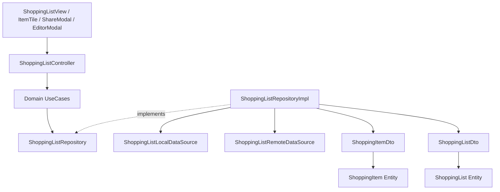

# Shopping List Module

**Purpose** — Encapsulates the core business logic, domain entities, and data access layer for the Advanced Shopping List feature. It supports both simple checklist items, complex items with rich properties (images, links, priority, notes, attributes), and collaborative sharing with other authenticated users.

**Key files** —
- [shopping_list/domain/entities/shopping_item.dart](../lib/features/shopping_list/domain/entities/shopping_item.dart) — Pure Dart entity representing a shopping item with rich attributes and optional `assignedToEmail`.
- [shopping_list/domain/entities/shopping_list.dart](../lib/features/shopping_list/domain/entities/shopping_list.dart) — Pure Dart entity representing a shopping list container with collaborative `ownerId`, `sharedWithEmails`, `shortDescription`, and `imageUrl`.
- [shopping_list/domain/repositories/shopping_list_repository.dart](../lib/features/shopping_list/domain/repositories/shopping_list_repository.dart) — Abstract repository contract for shopping list CRUD operations and sharing.
- [shopping_list/data/models/shopping_item_dto.dart](../lib/features/shopping_list/data/models/shopping_item_dto.dart) — DTO model handling JSON serialization and entity conversion including item assignment.
- [shopping_list/data/models/shopping_list_dto.dart](../lib/features/shopping_list/data/models/shopping_list_dto.dart) — DTO model for shopping list JSON serialization including sharing collaborators, short description, and image identifier.
- [shopping_list/data/datasources/shopping_list_local_datasource.dart](../lib/features/shopping_list/data/datasources/shopping_list_local_datasource.dart) — Local data source interface and in-memory cache implementation seeded with 3 rich multi-lists owned by Guy C (`guy@shoppingexplore.com`).
- [shopping_list/data/datasources/shopping_list_remote_datasource.dart](../lib/features/shopping_list/data/datasources/shopping_list_remote_datasource.dart) — Cloud data source interface for multi-user list filtering and collaborative sharing.
- [shopping_list/data/repositories/shopping_list_repository_impl.dart](../lib/features/shopping_list/data/repositories/shopping_list_repository_impl.dart) — Concrete repository implementation mapping DTOs to Domain Entities with AppLogger telemetry.
- [shopping_list/domain/usecases/](../lib/features/shopping_list/domain/usecases) — Business logic actions: `GetShoppingLists`, `CreateShoppingList`, `UpdateShoppingList`, `DeleteShoppingList`, `CreateShoppingItem`, `ToggleItemCompletion`, `UpdateItemProperties`, `DeleteShoppingItem`, `ShareShoppingList`.
- [shopping_list/presentation/controllers/shopping_list_controller.dart](../lib/features/shopping_list/presentation/controllers/shopping_list_controller.dart) — ViewModel managing list CRUD state (`ShoppingListState`) and operations with integrated logging.
- [shopping_list/presentation/views/shopping_list_view.dart](../lib/features/shopping_list/presentation/views/shopping_list_view.dart) — Main screen displaying items, dark/light theme toggle, collaborative share button, auth profile button, and quick-add checklist input.
- [shopping_list/presentation/widgets/shopping_item_tile.dart](../lib/features/shopping_list/presentation/widgets/shopping_item_tile.dart) — Reusable item card displaying checklist checkbox and rich badges (priority, notes, links, attributes).
- [shopping_list/presentation/widgets/shopping_item_editor_modal.dart](../lib/features/shopping_list/presentation/widgets/shopping_item_editor_modal.dart) — Modal bottom sheet for editing complex rich item properties.
- [shopping_list/presentation/widgets/shopping_list_share_modal.dart](../lib/features/shopping_list/presentation/widgets/shopping_list_share_modal.dart) — Dialog modal for managing list owner and adding new collaborator emails.
- [shopping_list/presentation/widgets/add_item_input.dart](../lib/features/shopping_list/presentation/widgets/add_item_input.dart) — Quick inline checklist entry bar.

**Dependencies** — Depends on [[core|Core Infrastructure]] (`Failure`, `Result`, `AppLogger`, Material 3 theme tokens) for error handling, telemetry, and styling, and [[auth|Authentication Module]] for user session identification.

**Flow** —

**Notes / gotchas** —
> [!info] Multi-List & Guy C Seeded Data
> `InMemoryShoppingListLocalDataSource.withDefaultData()` is seeded with 3 distinct lists owned by Debug User Guy C (`guy@shoppingexplore.com`): *Weekly Groceries*, *Tech & Electronics Wishlist*, and *Weekend BBQ Party*, each with assigned items (`assignedToEmail`) and short descriptions.

> [!info] Active Shopping Mode & Split 2-Section Checklist
> The `ShoppingListController` manages per-list Active Shopping Mode state (`_shoppingModes`, `_removedCartItemIds`). When shopping mode is active, removing an item moves it to Section 2 (*In Cart / Removed Items*) without deleting it from the repository. Users can either click **Complete Shopping** (permanently deletes marked items from datasource) or **Cancel Shopping** (restores all removed items back to Section 1 *Active Items* without data loss).

> [!info] Material 3 Styling Compliance
> Presentation components (`ShoppingListView`, `ShoppingItemTile`, `AddItemInput`, `ShoppingItemEditorModal`, `ShoppingListShareModal`) strictly utilize modern Material 3 theme tokens (`surfaceContainerHighest`, `withValues(alpha: ...)`, `initialValue`) to ensure zero-deprecation compatibility across light and dark themes.

