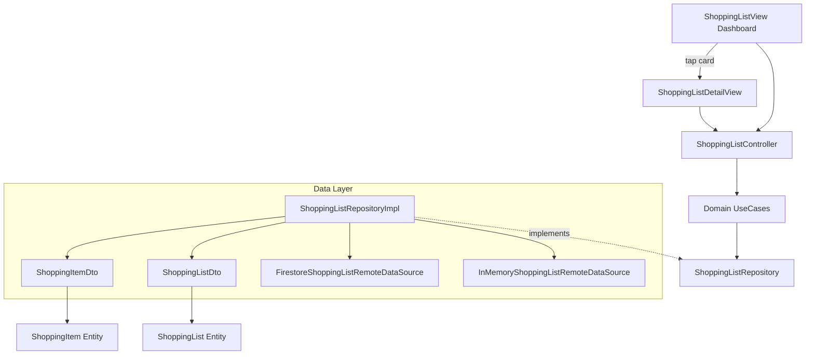

# Shopping List Module

**Purpose** — Encapsulates the core business logic, domain entities, data access layer, and stylish multi-list dashboard for the Advanced Shopping List feature. It supports simple checklist items, complex items with rich properties (images, links, priority, notes, attributes), collaborative sharing, Active Shopping Mode with split 2-section checklist, and a responsive card-based dashboard.

**Key files** —
- [shopping_list/domain/entities/shopping_item.dart](../lib/features/shopping_list/domain/entities/shopping_item.dart) — Pure Dart entity representing a shopping item with rich attributes and optional `assignedToEmail`.
- [shopping_list/domain/entities/shopping_list.dart](../lib/features/shopping_list/domain/entities/shopping_list.dart) — Pure Dart entity representing a shopping list container with collaborative `ownerId`, `sharedWithEmails`, `collaboratorDisplayNames`, `shortDescription`, and `imageUrl`.
- [shopping_list/domain/repositories/shopping_list_repository.dart](../lib/features/shopping_list/domain/repositories/shopping_list_repository.dart) — Abstract repository contract for shopping list CRUD operations and sharing (with optional collaborator display names).
- [shopping_list/data/models/shopping_item_dto.dart](../lib/features/shopping_list/data/models/shopping_item_dto.dart) — DTO model handling JSON serialization and entity conversion including item assignment.
- [shopping_list/data/models/shopping_list_dto.dart](../lib/features/shopping_list/data/models/shopping_list_dto.dart) — DTO model for shopping list JSON serialization including sharing collaborators, `collaboratorDisplayNames` map, short description, and image identifier.
- [shopping_list/data/datasources/shopping_list_local_datasource.dart](../lib/features/shopping_list/data/datasources/shopping_list_local_datasource.dart) — Local data source interface and in-memory cache implementation seeded with 3 rich multi-lists owned by Guy C (`guy@shoppingexplore.com`).
- [shopping_list/data/datasources/shopping_list_remote_datasource.dart](../lib/features/shopping_list/data/datasources/shopping_list_remote_datasource.dart) — Cloud data source interface for multi-user list filtering and collaborative sharing.
- [shopping_list/data/repositories/shopping_list_repository_impl.dart](../lib/features/shopping_list/data/repositories/shopping_list_repository_impl.dart) — Concrete repository implementation mapping DTOs to Domain Entities with AppLogger telemetry.
- [shopping_list/domain/usecases/](../lib/features/shopping_list/domain/usecases) — Business logic actions: `GetShoppingLists`, `CreateShoppingList`, `UpdateShoppingList`, `DeleteShoppingList`, `CreateShoppingItem`, `ToggleItemCompletion`, `UpdateItemProperties`, `DeleteShoppingItem`, `ShareShoppingList` (accepting optional `displayName`).
- [shopping_list/presentation/controllers/shopping_list_controller.dart](../lib/features/shopping_list/presentation/controllers/shopping_list_controller.dart) — ViewModel managing list CRUD state (`ShoppingListState`) and operations with integrated logging and `registerUserDisplayName` sync.
- [shopping_list/presentation/views/shopping_list_view.dart](../lib/features/shopping_list/presentation/views/shopping_list_view.dart) — **Multi-list dashboard ("All My Lists")** displaying greeting banner, responsive grid of `ShoppingListCard` widgets, language/theme toggles, and FAB for creating new lists. The main AppBar has a simplified layout without a title or logo.
- [shopping_list/presentation/views/shopping_list_detail_view.dart](../lib/features/shopping_list/presentation/views/shopping_list_detail_view.dart) — **Detail view** for a single list showing metadata header (title, description, progress, collaborators), Edit List navigation action, 2-section Active Shopping Mode checklist, and quick-add bar.
- [shopping_list/presentation/widgets/shopping_list_card.dart](../lib/features/shopping_list/presentation/widgets/shopping_list_card.dart) — Stylish card with category icon badge, title, short description, completion progress bar, and stacked collaborator avatars displaying resolved display names.
- [shopping_list/presentation/widgets/create_shopping_list_modal.dart](../lib/features/shopping_list/presentation/widgets/create_shopping_list_modal.dart) — Dialog modal for creating a new list with title, description, category icon picker, and color selector.
- [shopping_list/presentation/widgets/shopping_item_tile.dart](../lib/features/shopping_list/presentation/widgets/shopping_item_tile.dart) — Reusable item card displaying checklist checkbox, rich badges (priority, notes, links, attributes, assignee), and an RTL-aware inline quantity control next to the delete action.
- [shopping_list/presentation/widgets/shopping_item_editor_modal.dart](../lib/features/shopping_list/presentation/widgets/shopping_item_editor_modal.dart) — Modal bottom sheet for editing complex rich item properties.
- [shopping_list/presentation/widgets/shopping_list_share_modal.dart](../lib/features/shopping_list/presentation/widgets/shopping_list_share_modal.dart) — Dialog modal for managing list owner and adding new collaborator emails with optional display name input.
- [shopping_list/presentation/widgets/add_item_input.dart](../lib/features/shopping_list/presentation/widgets/add_item_input.dart) — Quick inline checklist entry bar.
- [shopping_list/domain/entities/product_suggestion.dart](../lib/features/shopping_list/domain/entities/product_suggestion.dart) — Domain entity for product variants or suggestions inside a shopping item (pros, cons, price, link, image).
- [shopping_list/presentation/views/shopping_item_detail_page.dart](../lib/features/shopping_list/presentation/views/shopping_item_detail_page.dart) — Full-screen page for viewing item details, editing, and managing `ProductSuggestion` instances.
- [shopping_list/presentation/widgets/product_suggestion_card.dart](../lib/features/shopping_list/presentation/widgets/product_suggestion_card.dart) — Visually rich card displaying a single product suggestion with a standardized closed height. Features +/- expand/collapse controls with auto-collapse on focus blur (via `TapRegion`), always-visible edit options, supporting both web HTTP URLs and local image file paths.
- [shopping_list/presentation/widgets/add_suggestion_modal.dart](../lib/features/shopping_list/presentation/widgets/add_suggestion_modal.dart) — Form modal for adding new suggestions to an item, integrating `ImageStorageService` for compressing camera/gallery images into persistent local storage alongside manual URL entry. Includes an expanding description field (up to 7 lines when focused).
**Dependencies** — Depends on [[core|Core Infrastructure]] (`Failure`, `Result`, `AppLogger`, Material 3 theme tokens) for error handling, telemetry, and styling, and [[auth|Authentication Module]] for user session identification.

**Flow** —

**Notes / gotchas** —
> [!info] Reactive Real-Time Sync Streams
> `ShoppingListRepository` and `ShoppingListRepositoryImpl` expose real-time broadcast streams (`watchShoppingLists`, `watchShoppingList`) that map to remote data sources like `FirestoreShoppingListRemoteDataSource`. Firestore streams are backed by `.snapshots()` enabling true real-time updates and offline persistence. `ShoppingListController` manages explicit stream subscriptions that automatically refresh domain state whenever any data source mutation occurs.

> [!info] Multi-List & Guy C Seeded Data
> `InMemoryShoppingListLocalDataSource.withDefaultData()` is seeded with 3 distinct lists owned by Debug User Guy C (`guy@shoppingexplore.com`): *Weekly Groceries*, *Tech & Electronics Wishlist*, and *Weekend BBQ Party*, each with assigned items (`assignedToEmail`) and short descriptions.

> [!info] 2-Section Checklist UI & Active Shopping Mode
> In normal mode (`!isShoppingMode`), `ShoppingListDetailView` partitions items into two distinct sections: **Section 1: To Buy** (`!isCompleted`, localized as `"To Buy"` / `"לקנות"`) above and **Section 2: Completed** (`isCompleted`, localized as `"Completed"` / `"הושלמו"`) below. A prominent **Live Sync** indicator pill is displayed in the AppBar actions.
> When Active Shopping Mode is enabled, removing an item moves it to **In Cart / Removed Items** without deleting it from the repository. Users can either click **Complete Shopping** (permanently deletes marked items from datasource) or **Cancel Shopping** (restores all removed items back to **Active Items** without data loss).

> [!info] Dashboard Architecture
> `ShoppingListView` serves as the home page dashboard ("All My Lists"), displaying all lists as responsive `ShoppingListCard` widgets in a `SliverGrid`. Tapping a card navigates to `ShoppingListDetailView` via `MaterialPageRoute`. The dashboard includes a gradient greeting banner and a `FloatingActionButton.extended` opening `CreateShoppingListModal`.

> [!info] Account & Profile Modal
> `AccountProfileModal` (accessible from `AuthUserButton` popup menu) displays a gradient avatar, display name, email, member since badge, and reactive statistics tiles (total lists, total items, shared lists).

> [!info] Material 3 Styling Compliance
> All presentation components strictly utilize modern Material 3 theme tokens (`surfaceContainerHighest`, `withValues(alpha: ...)`, `initialValue`) to ensure zero-deprecation compatibility across light and dark themes.

## Key files
- `[shopping_list/domain/entities/shopping_session.dart](../lib/features/shopping_list/domain/entities/shopping_session.dart)` — Entity representing an active shopping session with store location and start timestamp.
- `[shopping_list/presentation/widgets/active_shoppers_banner.dart](../lib/features/shopping_list/presentation/widgets/active_shoppers_banner.dart)` — Real-time active shoppers presence banner with Hebrew/English RTL support.
- `[shopping_list/presentation/widgets/start_shopping_modal.dart](../lib/features/shopping_list/presentation/widgets/start_shopping_modal.dart)` — Modal sheet for selecting store location when starting Active Shopping Mode.

