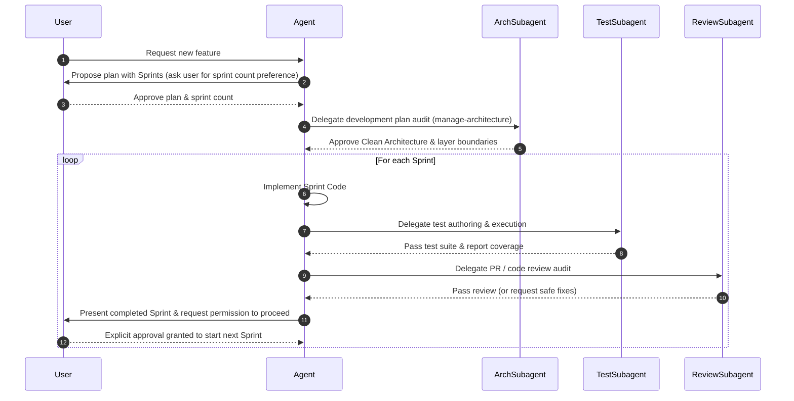

# Development & Sprint Execution Workflow

**Purpose** — Outlines the mandatory sprint breakdown, multi-agent peer review, dedicated testing subagent creation, and explicit execution approval gates for all feature development.

**Key files** —
- [.agents/AGENTS.md](../.agents/AGENTS.md) — Section 6 defines the workspace rules for sprint planning and gates.
- [.agents/skills/manage-architecture/SKILL.md](../.agents/skills/manage-architecture/SKILL.md) — Architecture manager skill for plan validation and layer boundary audits.
- [.agents/skills/review-pr/SKILL.md](../.agents/skills/review-pr/SKILL.md) — Peer review skill used by review subagents.

**Dependencies** — Applies across all feature modules including [[catalog|Catalog Module]] and [[core|Core Infrastructure]].

**Flow** —

**Notes / gotchas** —
> [!info] Architecture Governance Requirement
> Before any development plan or sprint is executed, the **Architecture Manager Subagent** (`manage-architecture`) must review and validate the plan to enforce Clean Architecture layer rules, `.NET Analogy` boundaries (zero UI imports in `domain/`), DTO serialization in `data/`, and `/docs/` synchronization.

> [!warning] Execution Pause Requirement
> Under no circumstances may an agent automatically start Sprint $N+1$ immediately after completing Sprint $N$. Explicit user permission is required at every sprint boundary.

> [!important] Branching & GitFlow Policy
> Never develop directly on the `main` branch. Every feature or sprint must be developed on an isolated feature branch (e.g., `feature/<name>` or `feature/<name>-sprint-<number>`). After tests and PR review pass, feature branches are merged into the `develop` branch. Merging `develop` into `main` is strictly reserved for the user or explicit user instruction.

